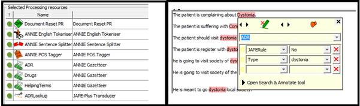
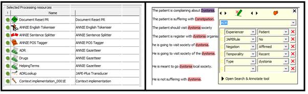
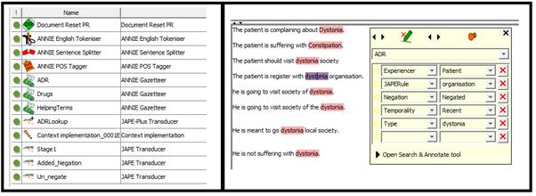
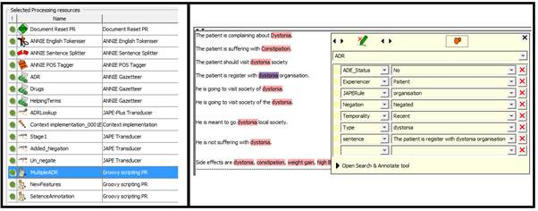
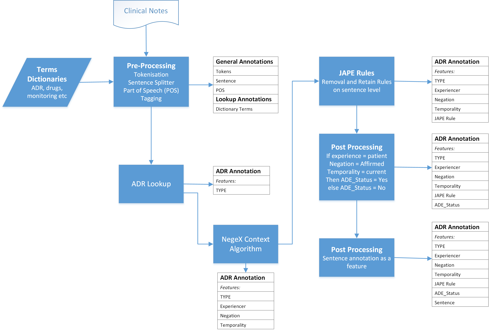

# ADRApp: Detects Adverse Drug Reactions from clinical text
A [GATE](https://gate.ac.uk/) application to detect Adverse Drug Reactions from clinical text.

## Author & Contributors
- **Ehtesham Iqbal <ehtesham.iqbal@kcl.ac.uk>**
- Richard Dobson <richard.j.dobson@kcl.ac.uk>
- Cass Johntson <caroline.johnston@kcl.ac.uk>
- Rob Stewart <robert.stewart@kcl.ac.uk>
- Zina Ibrahim <zina.ibrahim@kcl.ac.uk>
- Robbie Mallah <robbie.mallah@slam.nhs.uk>
- Stephen Newhouse <stephen.newhouse@kcl.ac.uk>

## Versions

|ADRapp Release|Version|
|----|----|
|Latest|[v2.0-alpha](https://github.com/KHP-Informatics/ADRApp/releases/tag/v2.0-alpha)|

Developed using: 

- GATE version: 8  
- Java Version: latest 
- Context Tagger version: 2015 release

Tested on Windows Verison 7. 

## Getting the App

1. Clone/Download the app.

```bash
git clone https://github.com/KHP-Informatics/ADRApp.git
```

or click the [**Download**](https://github.com/KHP-Informatics/ADRApp/archive/master.zip) button.


## Loading the App in GATE

- Open GATE
- Select: `File > Restore Application From File`
- point to `application.xgapp`

Its as easy as that!

## Running the App in GATE
[coming soon]


## Adding ADE New Terms

The current application comes with over 50 ADEs related to antipsychotic drugs.

If you wish to add more ADEs, please add them in [`application-resources\Gazeteer`](https://github.com/KHP-Informatics/ADRApp/tree/sjn-readme/application-resources/Gazeteer)

**Step 1.** Please create the `.lst` file, related terms for the ADE you wish to add. For example, if you want to create a list of ADE, fever. Add all the related terms for fever such feverish, feeling hot, high temperature into a file called `fever.lst`:

**create a new `.lst` file** 

```bash
cd application-resources/Gazeteer/

touch fever.lst

echo -e "
feverish
feeling hot 
high temperature
" >> fever.lst
```

**Step 2.** Please add `fever.lst` to the `application-resources/Gazeteer/ADR.def` file. The first few lines are shown below.

**the `ADR.def` file**

```
akathisia.lst:ADR:akathisia
alopecia.lst:ADR:alopecia
Amenorrhoea.lst:ADR:Amenorrhoea
Backache.lst:ADR:Backache
```

The format is `<list.lst>:<major>:<minor>` (see [GATE doc for details](https://gate.ac.uk/sale/tao/splitch13.html)).

**adding `fever.lst` to  `ADR.def`**

```bash
echo -e "fever.lst:ADR:fever" >> ADR.def
```

*You can do all this in any text editor of your choice!*

## How to improve this application
This section describes how to add new terms (negation, medication, drug names and others) to the application. [coming soon]

***************
# ADR Pipeline development
I started developing the app by picking up three random corpus for common ADEs (Dystonia, constipation and weight gain) and one rare ADE Steven Johnson. We measure the precision and recall on each corpus, once we made changes in dictionary terms and JAPE rules. This is not to over fit the application on one single ADE.

On the first step we strip down the pipelines with GATE built in resources (Document reset, Tokeniser, Sentence Splitter, Part of Speech (POS) Tagger, dictionary terms (ADE terms, Helping terms (all other terms) and Drug names), single JAPE rule ‘ADELookup’ which detects the ADE from clinical text as recorded in ADE terms dictionary and create a new annotation called ADR. This new annotation show two new features, Type (ADE Name) and JAPERule (The Name of the JAPE rules, if there is any used on this sentence)
 
 

In the second step we added the Context Tagger as processing resource. This processing creates three more features on ADR annotation, experiencer (Patients or others), negation (affirmed or negated) and temporality (recent, hypothetical or historical).

 

In the third step we implemented the JAPE rules in 3 distinct categories.
 
Stage1, the JAPE rules looks for punctuation which negates the presence of ADE in the sentence such as ADE discussion with ‘?’ or ‘@’. By these JAPE rules we changed the negation feature value to ‘negated’.
 
Removal Rules; generally where the clinicians are monitoring for ADE or it is merely a general discussion about the ADE. By these JAPE rules we changed the negation feature value to ‘negated’.
Retain Rules; where the context made it clear the ADE is present. By these JAPE rules we changed the negation feature value to ‘affirmed’.

 

In the 4th step we implemented a rule which create a new feature on ADE_Status and on the basis of features decided if ‘Yes’ or ‘No’ such as.
If the experiencer is ‘patient’, temporality is ‘current’ and negation is ‘affirmed’ then the ADE\_Status is ‘Yes’ else ‘No’. 

 


## ADR Pipeline Workflow

### ADR Pipeline Workflow with output annotation and features


### ADR Pipeline Workflow with output annotation and features (Extendedå)



## Acknowledgements
This work is funded by the National Institute for Health Research (NIHR) Biomedical Research Centre at South London and Maudsley NHS Foundation Trust and King’s College London. 